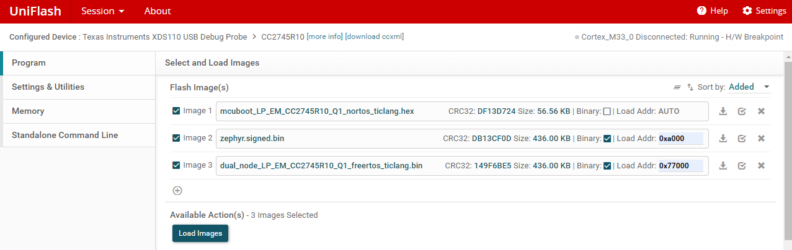
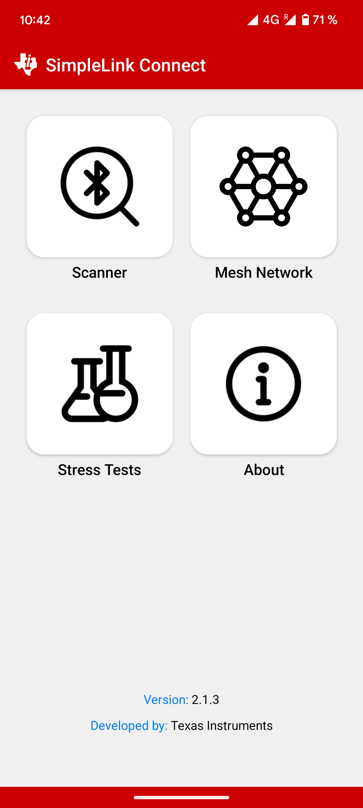
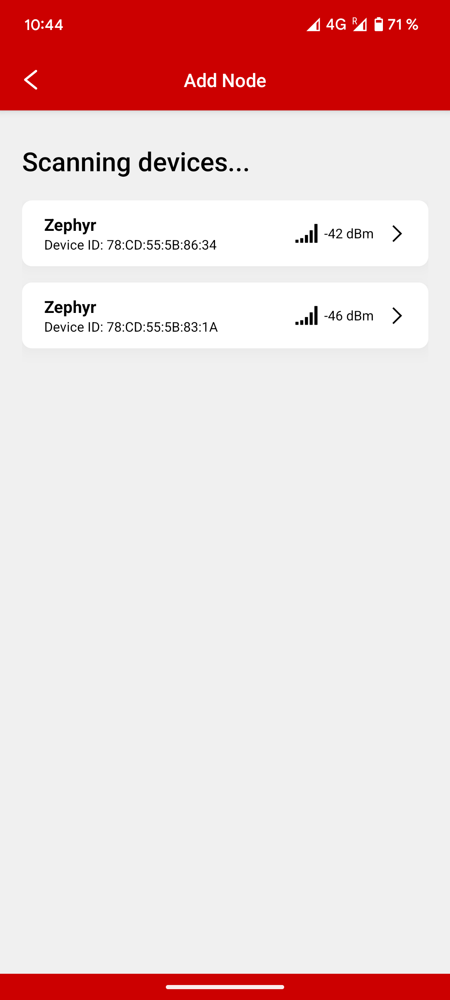
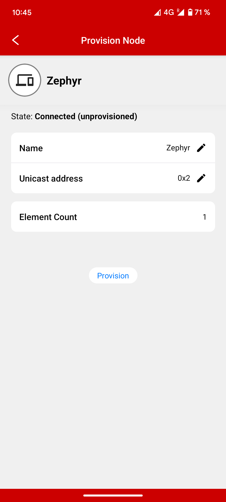
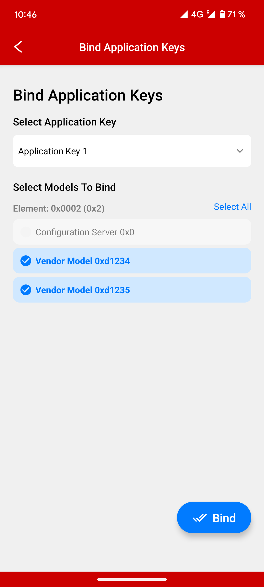
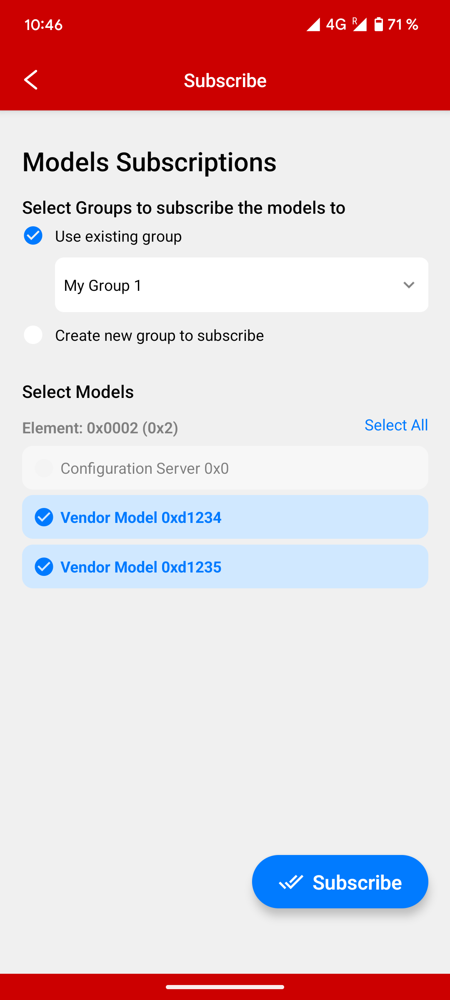
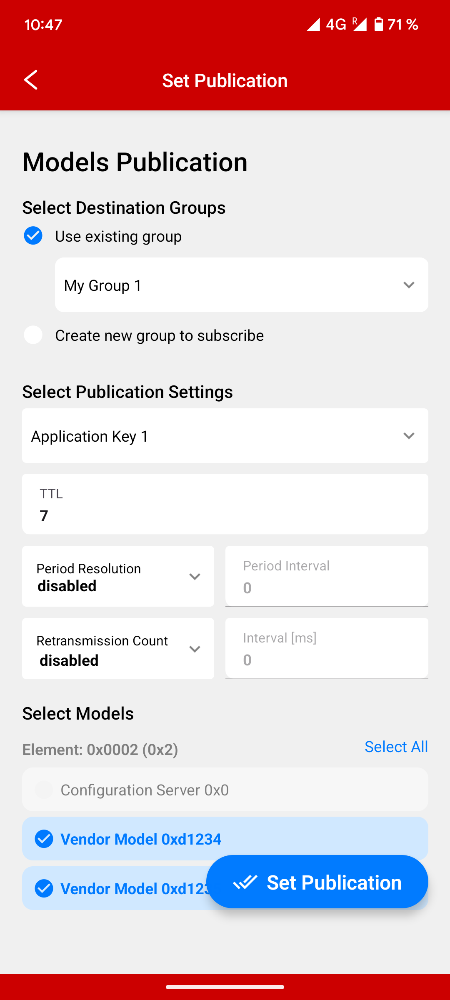
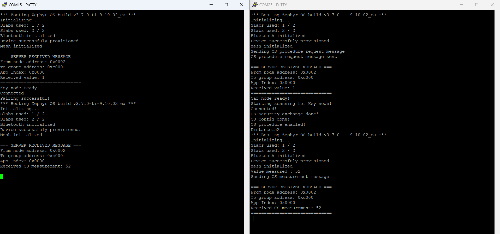

# Channel Sounding & Mesh project

Channel sounding is a feature currently exclusive to the SimpleLink SDK, while
Bluetooth Mesh is a feature currently exclusive to the Zephyr SDK. This project
aims to support both in one single application. The solution chosen to mix both
SDK is to use MCUBoot as a bootloader to switch between two images, one with
SimpleLink SDK and one with Zephyr SDK.

## How images are switched

The MCUBoot image is modified with the following code in the context_boot_go
function in the loader.c file :

```c
if(img_cnt > 1) //if we have more than 1 valid image
{
	slot = 0; // Boot to first image by default
	int flag_var = HWREG(PMCTL_BASE + PMCTL_O_AONRSTA1); // Read value of AON register 
	
	if((flag_var & 0x1) == 0x1) // If first bit is set to 1
	{
		slot = 1; // Boot to second image
	}

	hdr = boot_img_hdr(state, slot);
	selected_slot = slot;
	selected_image_header = hdr;
}
```

This code changes the decision process of MCUBoot when selecting which image
to boot. Usually, the version number of both images are compared, and the 
image with the highest version number is selected. 

In this modified MCUBoot image, the image chosen is decided by the first bit 
of the AON (Always ON) register (see [Chapter 6.8 AON (REG3V3) Register Bank of the Technical Reference Manual](https://www.ti.com/lit/ug/swcu195a/swcu195a.pdf)). 
The value of this register is retained in shutdown and in reset, which makes it
a very good candidate to transfer information such as which image to boot.

When switching from the first image to the second image, the process is to set
the first bit of the AON register to 1, and call the HapiResetDevice function 
to reset the device.

When switching from the second image to the first image, the process is to set
the first bit of the AON register to 1, and call the HapiResetDevice function 
to reset the device.

## Mesh network

The mesh network provides two vendor specific models. 

The first model is used to request a CS procedure to the other nodes. Nodes 
that receive this message will restart into the Channel Sounding image with 
the reflector role. The node sending the message will restart into the Channel
Sounding image with the initiator role. Currently the demo is made for two 
nodes, but it is possible to change the Zephyr image to send this message to
specific unicast addresses.

The second model is used to send the measurement results of the CS procedure 
from the initiator node to the other nodes.

## Sending information between images

The AON register is used to send information between two images, because its 
value is kept during shutdown and reset. The AON register has 18 bits for 
application data in the FLAG field. As said previously, bit 0 of this register 
is used by MCUBoot to determine which image should be selected. 

When switching from the Zephyr image to the SimpleLink image, bit 1 is used 
to choose between the Key Node/Reflector role and the Car Node/Initiator role.
When bit 1 is set, Car Node/Initiator role is selected.
When bit 1 is cleared, Key Node/Reflector role role is selected.

When switching from the SimpleLink image to the Zephyr image, bits 17 to 1 are 
used to transfer the distance between the two nodes. This implies that the 
maximum distance that can be measured between two nodes is currently 2^17 cm, 
which is 131.072 meters. 

While this data could also be transferred through Non-Volatile Storage (NVS), 
due to worries about flash wear, we decided to use the AON register. If the 
Channel Sounding measurements are not done often, it would be possible to 
switch from using the AON register to using NVS for more space for data 
transfers between the two images.

## Flash layout

The flash is currently laid out as such :
```
     0x0 +----------------+
         |     MCUBoot    |
  0xa000 +----------------+
         |     Zephyr     |
 0x77000 +----------------+
         |   SimpleLink   |
 0xE4000 +----------------+
         | NVS (BLE Bonds)|
 0xE8000 +----------------+
         |  HSM Firmware  |
0x100000 +----------------+
```

# Using the project

## Building the MCUBoot image

Open the Node folder in CCS, right click the MCUBoot project, and select 
`Build Project`. This will create the `mcuboot_LP_EM_CC2745R10_Q1_nortos_ticlang.hex`
file in the `Debug` folder.

## Building the Dual Node image

The Dual Node image is using the 9.14.2.01 SDK. Channel Sounding APIs might
change between versions of SDKs, so it is recommended to install this exact
version.

### Building the image

Open the Node folder in CCS, right click the Dual Node project, and select 
`Build Project`. This will create the `dual_node_LP_EM_CC2745R10_Q1_freertos_ticlang.bin`
file in the `Release` folder.

## Building the Zephyr image

Since we are using MCUBoot, we need to sign images. While CCS automatically
calls the script to sign the firmware in the post-build steps, we need to
manually sign the image using `west sign`. First we move the `mesh_cs` folder 
into the 
`zephyrproject` folder, and we place the `mesh_cs` folder in this folder:

`west build -p always -b lp_em_cc2745r10_q1/cc2745r10_q1 -d build_mesh_cs mesh_cs`
`west sign -t imgtool -d build_mesh_cs/ -- --version 1.0.0 --pad --key bootloader/mcuboot/root-ec-p256.pem`

This will create the `zephyr.signed.bin` file in the `build_mesh_cs/zephyr` 
folder.

## Flashing the project using UniFlash

By using the flash layout presented previously, we can use the following
flashing setup in UniFlash :



## Provisioning the devices

Once both CC2745R10-Q1 LaunchPads are flashed with the project, we can use the
SimpleLink Connect application on smartphones to provision the devices.

1) Open the `Mesh Network` and click `Add node`. For the first time setup, you
will need to create an Application Key.



2) Select one of the device called `Zephyr`.



3) Provision the device using the `Provision` button.



4) Click `Quick Node Setup`, and bind all application keys, subscribe to all 
models and set publications to all models with the default settings. For the 
first time setup, you may need to create a group with the default settings.





5) Go back at the start and provision the other node in the same way.

## Running the entire demo

Once both nodes are provisioned, you can press the left button on one of the
boards. It will automatically send a mesh message to the network to restart
into channel sounding, run the measurements, restart into the mesh image and
send the image.



# Current limitations

- Since in the SimpleLink application we do not have Mesh capabilities, we need
to assume the time for the application to switch images before sending CS 
results. For now this time is assumed to be 2 seconds, but some improvements
on the synchronization for the switch of both images may be possible.

- 2x2 antenna setup using the BoosterPack is not working with the dual_node
example. This is an issue with the example and not the CS libraries, and we 
are working on fixing this and releasing a fix for the example.
