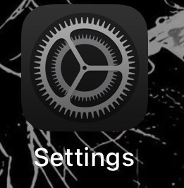
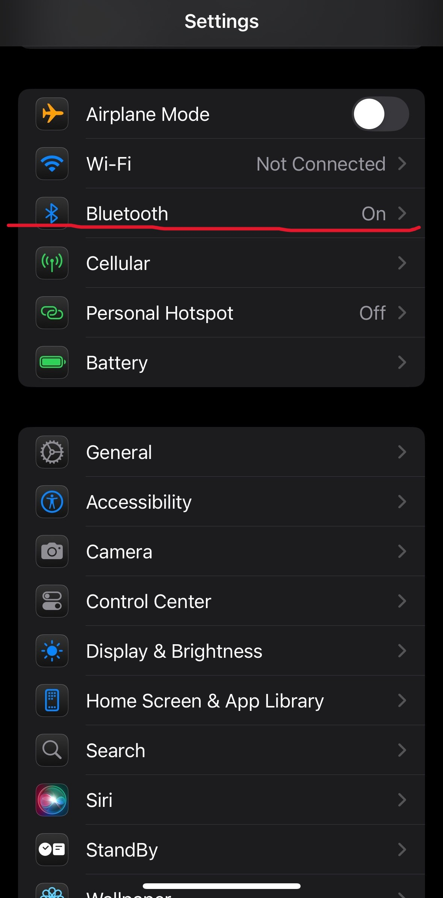
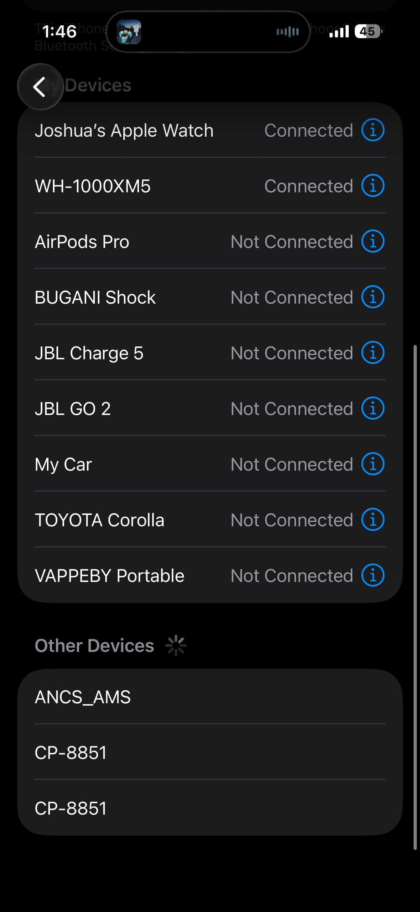
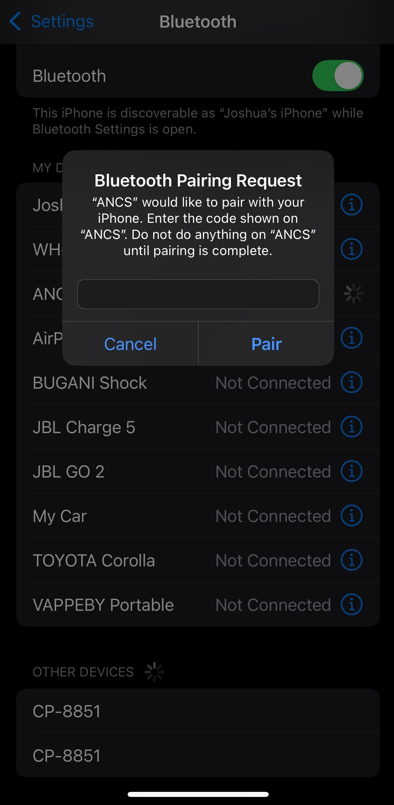
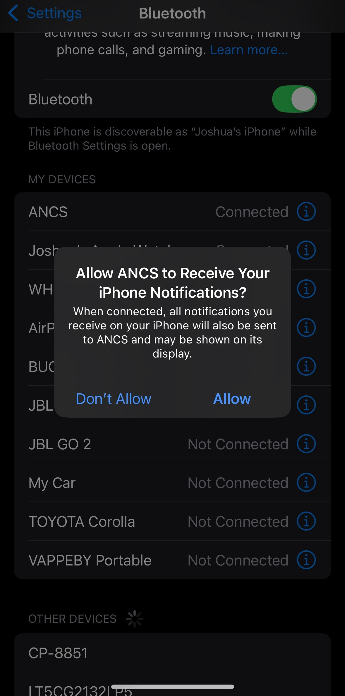
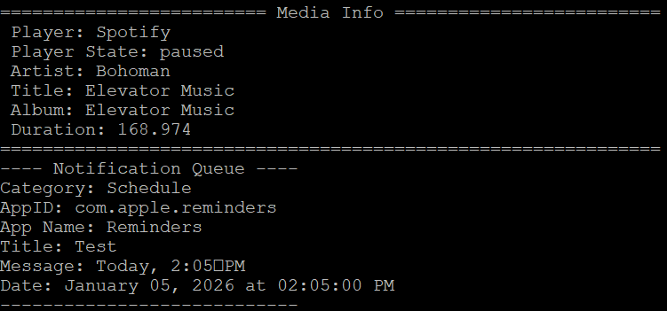
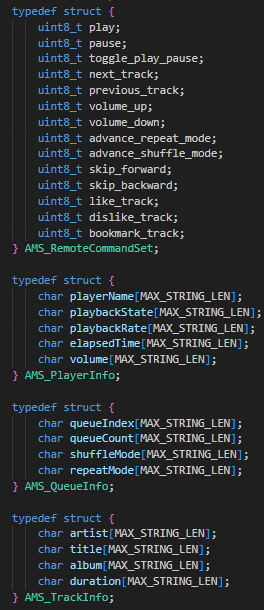
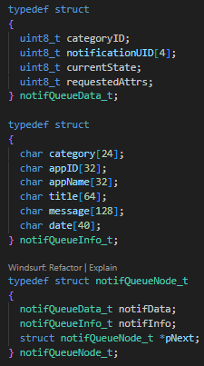

# Table of Contents

- [Table of Contents](#table-of-contents)
- [Basic BLE ANCS/AMS Example](#basic-ble-ancsams-example)
  - [Introduction](#introduction)
  - [Features](#features)
    - [Hardware Prerequisites](#hardware-prerequisites)
    - [Software Prerequisites](#software-prerequisites)
    - [Device roles](#device-roles)
  - [Background](#background)
  - [Getting started](#getting-started)
    - [Build and Run](#build-and-run)
    - [Connecting to device](#connecting-to-device)
  - [Usage](#usage)
    - [Serial Communication Output Example](#serial-communication-output-example)
  - [Customization](#customization)
    - [Accessing AMS/ANCS info](#accessing-amsancs-info)
    - [Changing Notification Queue size](#changing-notification-queue-size)
    - [Enable/Disable Serial Terminal Menu](#enabledisable-serial-terminal-menu)
    - [Enabling pre-existing notifications](#enabling-pre-existing-notifications)
    - [Sending AMS commands](#sending-ams-commands)
    - [Project Structure](#project-structure)
  - [Troubleshooting](#troubleshooting)
    - [Common Issues](#common-issues)
  - [Support](#support)

# Basic BLE ANCS/AMS Example

## Introduction

This project demonstrates a Bluetooth Low Energy (BLE) application for TI CC27xx devices, focusing on Apple Notification Center Service (ANCS) and Apple Media Service (AMS) integration. It supports multiple BLE roles, GATT service discovery, notification parsing, and a UART-based menu interface for displaying media and notification information.

## Features
- Integration with Apple Notification Center Service (ANCS)
- Integration with Apple Media Service (AMS)
- Notification parsing and processing from iOS devices
- Media information parsing and display
- Serial terminal output for notifications and media info
- Configurable notification queue size
- Option to enable/disable serial terminal menu
- API for sending AMS remote commands (e.g., play, pause, next track)
- Modular project structure for easy customization and extension

### Hardware Prerequisites
- **Primary**: CC27XX development board
- **Secondary**: iOS device (iPhone/iPad) with iOS 10.0 or later
- **Connection**: USB cable for flashing and UART communication

### Software Prerequisites
- **IDE**: Code Composer Studio (CCS) 20.4+ or IAR Embedded Workbench
- **SDK**: TI SimpleLink F3 SDK (9.14+ recommended)
- **Terminal**: Serial terminal software (PuTTY, Tera Term, or similar)
- **Baud Rate**: 115200 (if not specified elsewhere)
  
### Device roles
The device will act as a peripheral and a GATT client.
- **BLE Peripheral**: Advertises and accepts connections from iOS devices
- **GATT Client**: Subscribes to ANCS/AMS services on the iOS device (GATT Server)
- **Service Consumer**: Receives and processes notifications and media updates

## Background
Apple has specific design guidelines for interacting with their devices that can be found here [Apple Design Guidelines](https://developer.apple.com/accessories/Accessory-Design-Guidelines.pdf)

The specifics of interacting with the Apple Notification Center Service (ANCS) can be found here [ANCS spec](https://developer.apple.com/library/archive/documentation/CoreBluetooth/Reference/AppleNotificationCenterServiceSpecification/Specification/Specification.html#//apple_ref/doc/uid/TP40013460-CH1-SW7)

The specifics of interacting with the Apple Media Service (AMS) can be found here [AMS spec](https://developer.apple.com/library/archive/documentation/CoreBluetooth/Reference/AppleMediaService_Reference/Specification/Specification.html#//apple_ref/doc/uid/TP40014716-CH1-SW7)

NOTE: To initiate pairing with an iOS device the iOS device has to attempt to read an encrypted service/characteristic on the device. This can be done by changing the permissions of a characteristic to GATT_PERMIT_ENCRYPT_READ

## Getting started
### Build and Run

1. Import the project into your IDE.
2. Build the project.
3. Flash to your CC27xx device.
4. Open a serial terminal at 115200 baud rate

### Connecting to device
1. Go to general settings on your iOS device 
   
   
2. Open the bluetooth settings
   
   
3. Look for the ANCS_AMS device in "other devices" and press to connect to it
   
   

4. Input the pairing code 123456 when prompted
   
   

5. Once the ANCS service is found and subscribed to allow the device to receive iOS notifications
   
   

## Usage

### Serial Communication Output Example
Once connected and iOS notifications are allowed to be shared the notification information and media information will automatically be displayed



## Customization

### Accessing AMS/ANCS info
All of the notification and AMS information is stored in structs defined in app_ancs.h for ease of use. For this example these structs are used to display information on the serial terminal but it can be used as desired.
1. **AMS structs**

   

2. **ANCS queue structs**
   
   

### Changing Notification Queue size
The size of the notification queue can be changed through the use of the MAX_NOTIF_QUEUE_SIZE macro located in app_parse.c

### Enable/Disable Serial Terminal Menu
The media and notification window seen above can be enabled/disabled through the use of the ENABLE_MENU macro defined in app_ancs.h

### Enabling pre-existing notifications
If it is desired to process pre-existing notifications, it can be enabled through the IGNORE_PREEXISTING_NOTIFICATIONS macro. Enabling pre-existing notifications is not recommended because if there are a lot it can flood the system and cause the system to be overwhelmed


### Sending AMS commands
To interact with the AMS service on the iOS device via the BLE device a remote command can be sent with the ams_sendRemoteCommands api. The list of possible commands is received when connecting to the device and stored in gAmsRemoteCommands. The list of all possible commands can be seen in app_ancs.h

Example: 
```c
// Send media control commands
ams_sendRemoteCommands(REMOTE_CMDID_PLAY);
ams_sendRemoteCommands(REMOTE_CMDID_PAUSE);
ams_sendRemoteCommands(REMOTE_CMDID_NEXT_TRACK);
```


### Project Structure
```
├── app/
│   ├── app_ancs.c              # ANCS state machine & notification handling
│   ├── app_ams_parse.c         # AMS commands & media info parsing
│   ├── app_parse.c             # iOS notification parsing utilities
│   ├── app_main.c/h            # Application entry point & main logic
│   ├── app_connection.c        # BLE connection management
│   ├── app_peripheral.c        # Peripheral role implementation
│   ├── app_pairing.c           # Device pairing logic
│   └── Profiles/               # GATT profile implementations
│       ├── app_dev_info.c      # Device Information Service
│       └── app_simple_gatt.c   # Simple GATT Profile
├── common/                     # Shared utilities & TI drivers
├── syscfg/                     # Auto-generated configuration files
├── targetConfigs/              # Debug probe configuration (.ccxml)
└── main_freertos.c             # FreeRTOS main entry point
```

## Troubleshooting

### Common Issues
- **Device not visible**: Ensure device is advertising and iOS Bluetooth is enabled
- **Pairing fails**: Verify pairing code is `123456`
- **No notifications**: Check iOS notification permissions for the app
- **Build errors**: Verify TI SDK installation and version compatibility

## Support

For more information, refer to the [TI User's Guide](https://dev.ti.com/tirex/explore/node?node=AFX6v43sobHV7V3aGkO78g) or contact TI support.
