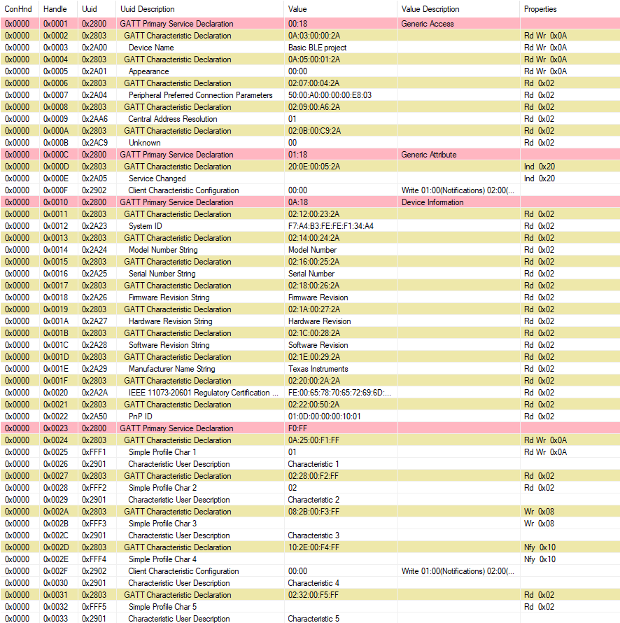
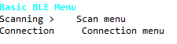
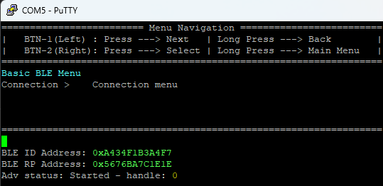
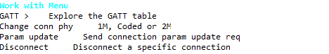
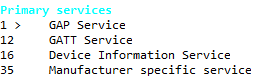
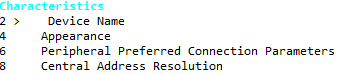
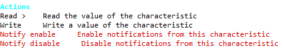
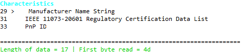
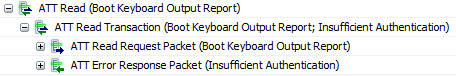

# Full GATT Client Example

## Table of Contents

<!-- @import "[TOC]" {cmd="toc" depthFrom=2 depthTo=6 orderedList=false} -->

<!-- code_chunk_output -->

- [Full GATT Client Example](#full-gatt-client-example)
   - [Table of Contents](#table-of-contents)
   - [Example Summary](#example-summary)
   - [Required Hardware](#required-hardware)
   - [Dependencies](#dependencies)
   - [Explaination of the example](#explaination-of-the-example)
      - [What is a GATT table](#what-is-a-gatt-table)
      - [How is the GATT table being read](#how-is-the-gatt-table-being-read)
   - [Setting up the project](#setting-up-the-project)
   - [Example of exploring the table](#example-of-exploring-the-table)
      - [1. Setting up the boards](#1-setting-up-the-boards)
      - [2. Scanning and connecting to the peripheral](#2-scanning-and-connecting-to-the-peripheral)
      - [3. Exploring the GATT table](#3-exploring-the-gatt-table) 
   - [Changing the example](#changing-the-example)
      - [Changing the data written on the Write action](#changing-the-data-written-on-the-write-action)
      - [SRAM and flash usage](#sram-and-flash-usage)
      - [Enabling or disabling the UUID translation](#enabling-or-disabling-the-uuid-translation)
      - [Exploring more than one peripheral](#exploring-more-than-one-peripheral)
   - [Known Limitations](#known-limitations)

<!-- /code_chunk_output -->

## Example Summary

The `full_GATT_client_ble_LP_EM_CC2340R5_freertos_ticlang` example project uses 
the CC2340R5 to explore the content of any Generic Attribute Profile (GATT) 
Table. This table defines how data is organized and exchanged between two BLE 
devices. The example allows to read, write, manage notifications of the GATT 
table of a peripheral device using ATT requests, with the following features:

 * Easy to use menu: a menu is accessible after a successful connection with a 
 peripheral device. The GATT menu lists the primary services of the GATT table.
 Those services lead to another menu with the list of the characteristics of 
 the select primary service.

 * 4 possible interactions: the project allows for the central to read, write, 
 enable notifications and disable notifications of the peripheral.

 * Permission management: the unpermitted actions are highlighted in red in the
 actions menu.

Unlike the `Basic_BLE_gatt_client` example, which has the handle of the 
characteristics from the Basic BLE example hardcoded into the client, this 
example dynamically explores the GATT table with no prior knowledge about the 
UUIDs or handles of its content. 

For testing purposes, a peripheral with a GATT table is needed. Any of the 
peripheral examples from the F3 SDK can be used.

## Required Hardware

* Central
  * 1 x [LP-EM-CC2340R5](https://www.ti.com/tool/LP-EM-CC2340R5)
  * 1 x [LP-XDS110ET](https://www.ti.com/tool/LP-XDS110ET)

* Peripheral
  * 1 x Your peripheral

## Dependencies

* `full_GATT_client_ble_LP_EM_CC2340R5_freertos_ticlang`
  * Simplelink F3 SDK 8.40.02.01
  * Code Composer Studio 12.8.1 / Code Composer Studio Theia 20.1.1
  * UniFlash 9.0.0.5086

## Explaination of the example

### What is a GATT table

GATT, which stands for Generic ATTribute Profile, outlines how two Bluetooth 
Low Energy devices exchange data using Services and Characteristics. It 
employs a generic data protocol known as the Attribute Protocol (ATT). This 
protocol stores Services, Characteristics, and associated data in a 
straightforward lookup table, utilizing 16-bit IDs for each entry.

In the [Basic BLE example](https://dev.ti.com/tirex/explore/node?node=A__AGRf8vVWaZBHN5ZauZKBUA__com.ti.SIMPLELINK_LOWPOWER_F3_SDK_BLE5STACK_MODULE__58mgN04__LATEST) 
from the F3 SDK, the GATT Table looks like this in BTool. The services are in 
red, the characteristics are in yellow, and the values are in white.

### How is the GATT table being read

The goal of this example is to discover a GATT table. This is done by first 
discovering the services of the GATT table through the API function 
[GATT_DiscAllPrimaryServices](https://software-dl.ti.com/simplelink/esd/simplelink_cc13x2_26x2_sdk/4.20.00.35/exports/docs/ble5stack/ble_user_guide/doxygen/ble/html/group___a_t_t___g_a_t_t.html#gaa9323c71f318bcf8a1cddad9ac4458ac). 
This function will send an ATT event with the type `ATT_READ_BY_GRP_TYPE_RSP`, 
which will contain all the services that the GATT table exposes. A service is 
described as start handle, an end handle and a UUID. If we look at the GATT 
Table from the Basic BLE example extracted with BTool, we can see that the 
`Device Informmation` service has a start handle of `0x0010`, an end handle of 
`0x0022`, and a UUID of `0x2800`.

Once all services are known, the example will discover their characteristics. 
This is done by calling the API function 
[GATT_DiscAllChars](https://software-dl.ti.com/simplelink/esd/simplelink_cc13x2_26x2_sdk/4.20.00.35/exports/docs/ble5stack/ble_user_guide/doxygen/ble/html/group___a_t_t___g_a_t_t.html#gac824af509fbd28c84ae6a1d1d4a1ba11). This function
will ask the GATT table for the list of characteristics for each service, and 
will reply with an ATT event with the type `ATT_READ_BY_TYPE_RSP`, which will 
contain all the characteristics of the desired service. A characteristic is 
described as its handle, its permissions and the UUID and handle of its value. 
If we look at the GATT Table from the Basic BLE example extracted with BTool, 
we can see that the `Manufacturer Name String` characteristic has a handle of 
`0x001D`, a UUID of `0x292A`, permission flags set to `0x02` and a value 
handle of `0x001E`.

Lastly, once we have the characteristics, the example will discover their 
value. This is done by calling the API function 
[GATT_ReadCharValue](https://software-dl.ti.com/simplelink/esd/simplelink_cc13x2_26x2_sdk/4.20.00.35/exports/docs/ble5stack/ble_user_guide/doxygen/ble/html/group___a_t_t___g_a_t_t.html#gab1628c683ea6ba34a41af178c8b88bb3).
This function will ask the GATT table for the value of the charactersitic 
given, and will reply with an ATT event with the type `ATT_READ_RSP`, which 
will contain the value of the desired characteristic. If we look at the GATT 
Table from the Basic BLE example extracted with BTool, we can see that the 
value for the `Manufacturer Name String` characteristic is the string 
`Texas Instruments`. In reality, the value is an array of bytes, and it is 
BTool that interpreted this value as a string.

However, this method of reading the GATT table is only useful if you do not 
know the services or characteristics beforehand. If you already know the UUIDs 
of the services and characteristics you want to explore (for example 0x180F for
the Battery Service), it would be better to use the 
[GATT_DiscPrimaryServiceByUUID](https://software-dl.ti.com/simplelink/esd/simplelink_cc13x2_26x2_sdk/4.20.00.35/exports/docs/ble5stack/ble_user_guide/doxygen/ble/html/group___a_t_t___g_a_t_t.html#gab3f4fbcaa18ec38accf7ac22eff3365e), 
[GATT_DiscCharsByUUID](https://software-dl.ti.com/simplelink/esd/simplelink_cc13x2_26x2_sdk/4.20.00.35/exports/docs/ble5stack/ble_user_guide/doxygen/ble/html/group___a_t_t___g_a_t_t.html#ga747eaf3fb0358c4e05171b40d09c1906) and 
[GATT_ReadCharValue](https://software-dl.ti.com/simplelink/esd/simplelink_cc13x2_26x2_sdk/4.20.00.35/exports/docs/ble5stack/ble_user_guide/doxygen/ble/html/group___a_t_t___g_a_t_t.html#gab1628c683ea6ba34a41af178c8b88bb3) 
functions directly. Those functions also return ATT events with the type 
`ATT_READ_BY_GRP_TYPE_RSP`, `ATT_READ_BY_TYPE_RSP` and  `ATT_READ_RSP`.

To read more about ATT requests, you can read the 
[F3 SDK User Guide](https://dev.ti.com/tirex/content/simplelink_lowpower_f3_sdk_8_40_00_61/docs/ble5stack/ble_user_guide/html/ble-stack-5.x/gatt-cc23xx.html) 
about this subject, or 
[the article about ATT & GATT from NovelBits](https://novelbits.io/bluetooth-le-att-gatt-explained-connection-oriented-communication/).

## Setting up the project

1. First, open Code Composer Studio and create a new workspace

2. Import the project by clicking Project > Import CCS Projects ...

3. Browse to the `full_GATT_client_ble_LP_EM_CC2340R5_freertos_ticlang` folder,
and click Finish

4. In the Project Explorer tab on the left, left click the `full_GATT_client` 
project to select it

5. Click the Debug (green bug) button at the top.

6. Once the project has finished building and is flashed on the board, click 
the Resume (green triangle) button.

## Example of exploring the table

The GATT table from any peripheral can be used as an example for this example. 
A peripheral with a GATT table that contains both regular services 
(GAP service, GATT service, Device Information service) and manufacturer 
specific services can be a good example. Here's a step-by-step guide on how to 
explore the GATT table of this peripheral : 

### 1. Setting up the boards

On your `CC2340R5`, you can flash the 
`full_GATT_client_ble_LP_EM_CC2340R5_freertos_ticlang` using this document's 
[getting started section](#setting-up-the-example).

Once the example has been flashed on the board, you can open a 
**serial terminal** on the communication port of your `CC2340R5`, with a baud 
rate of `115200` to recieve the UART data for the example. 

This step is successful if you see the following menu in your serial terminal :

### 2. Scanning and connecting to the peripheral

You can control the menu using the two buttons on the `CC2340R5`. To start 
scanning, you have to open the Scan menu by selecting the `Scanning` item, and 
select `Scan`. After a second, the scan is finished and you can come back to 
the main menu with a long press of the right button.

To connect to your peripheral, you can select the `Connection` item from the 
main menu and then select `Connect`. You'll be presented with all the BLE 
addresses that were scanned previously. You can now select the address of your 
peripheral to connect to it.

*Tip : If you are using the Basic BLE project as your peripheral, it is*
*written in green in the Serial Terminal for your Basic BLE project.*

If you can't find your peripheral address among the list of connectable 
addresses, you need to re-scan with your central being closer to your 
peripheral.

Once connected, you can go back to the main menu, and go to 
`Connection` > `Work with` > `<your BLE address>`. This step is successful if 
you see this menu :

### 3. Exploring the GATT table

From this menu, you can select the `GATT` item. After a little loading time, 
you should see a list of all the **primary services** of your peripheral's 
GATT table :

The number on the left of the service is the handle of the service. The name 
of the services are deduced from their UUID, and compared to the UUID table in 
the [Assigned Numbers bluetooth specification section 3.4.1](https://www.bluetooth.com/wp-content/uploads/Files/Specification/HTML/Assigned_Numbers/out/en/Assigned_Numbers.pdf).

Once you select a primary service (GAP Service in our example), you can see 
all of its **characteristics** :

Just like for the services, the number on the left of the service is the 
handle of the characteristic. The name of the characteristics are deduced from 
their UUID, and compared to the UUID table in the 
[Assigned Numbers bluetooth specification section 3.8.1](https://www.bluetooth.com/wp-content/uploads/Files/Specification/HTML/Assigned_Numbers/out/en/Assigned_Numbers.pdf).

You can select a characteristic (Device Name in our example) to open the 
action menu : 

If you select the `Read` action, you will read the entire value the 
characteristic you selected. Because you have no way of knowing the format of 
the data returned (String, number, bit, ...), the example only displays the 
first byte of the data and the total length of the data recieved. While the 
example does not display all of the data, it is still stored in a variable. 

For the Device Name characteristic, this will return **4D**, which is the 
ASCII representation of an uppercase **M**. For the peripheral chosen for this 
example, this is because the complete value of the device name characteristic 
is "Manufacturer Name".

If you select the `Write` action, you will write four predetermined bytes into 
the characteristic. To check if the write is successful, you can execute a 
`Read`, followed by a `Write` and then another `Read`. You will get a 
different result than your first `Read`.

The `Notify enable` and `Notify disable` are inaccessible because Device Name 
is not a notification characteristic. To enable or disable notificaitons, you 
can select the `Manufacturer specific service` and the fourth 
`Manufacturer specific characteristic` with handle 45. Here, selecting 
`Notify enable` and `Notify disable` will respectively enable and disable 
notifications for this handle. When a notification is recieved, it will 
display at the bottom of the serial terminal.

## Changing the example

### Changing the data written on the Write action

In the example, the data written is always the four bytes 
`0x00, 0x02, 0x55 and 0xFF`. To change the data written in the GATT 
characteristic when chosing the Write action, you can change the value of the 
variable `charVals` in the `Menu_GattCharWriteCB` function in `app_menu.c`.

### SRAM and flash usage

This example uses around 18 kB more Flash memory than the basic_ble_GATT_client 
example, and around 1.5 kB more SRAM memory.

The additional SRAM memory is used for memory buffers and used to store 
services and characteristics. This data is kept in memory until the device is 
disconnected, in case the user wants to go to the previous menu when exploring 
the GATT table. If not using a menu, it's possible to free the memory as soon 
as it is used, to reduce SRAM usage.

### Enabling or disabling the UUID translation

The 18 kB additional Flash memory is mainly due to the UUID translation table. 
When exploring the GATT table, the UUID of the service or the characteristic 
is used to determine its type. For example, when reading `0A:18` as a service 
UUID, the software is able to translate this UUID into the `Device Information`
string. This is done through a large conversion table that takes 16 Kilobytes 
of Flash space. 

If you wish to save on those 16 kB, you can disable this 
feature by setting `IS_UUID_TRANSLATION_ENABLED` to `0` in 
`GATT/assigned_numbers/app_assigned_numbers.c`. When the UUID translation is 
disabled, all services will appear as "Manufacturer specific service" and all 
characteristics will appear as "Manufacturer specific characteristic".

### Exploring more than one peripheral

The example supports connecting to more than one peripheral at the same time.
In order to set how many simultaneous communications are accepted by the 
example, you can set the `Max Number of Connections` to the desired number of
connections in the sysconfig file, in the `BLE` > `General Configuration` 
section. 

## Known Limitations

* Some GATT entries need to be authenticated to be read or written to. This is 
done through using a method of pairing like passkey or numeric comparison. 
Currently the only pairing method supported is Just Works, which will allow 
the example to read characteristics that need encryption, but not the 
characteristics that need authentication. 

* The GATT client is incapable of knowing if a GATT entry needs an 
authentification or not, and will not display the read value if it's the case. 
If you suspect that a GATT entry needs authentification, you can use a 
**BLE sniffer** to check. The ATT request from the GATT client should look 
like this

