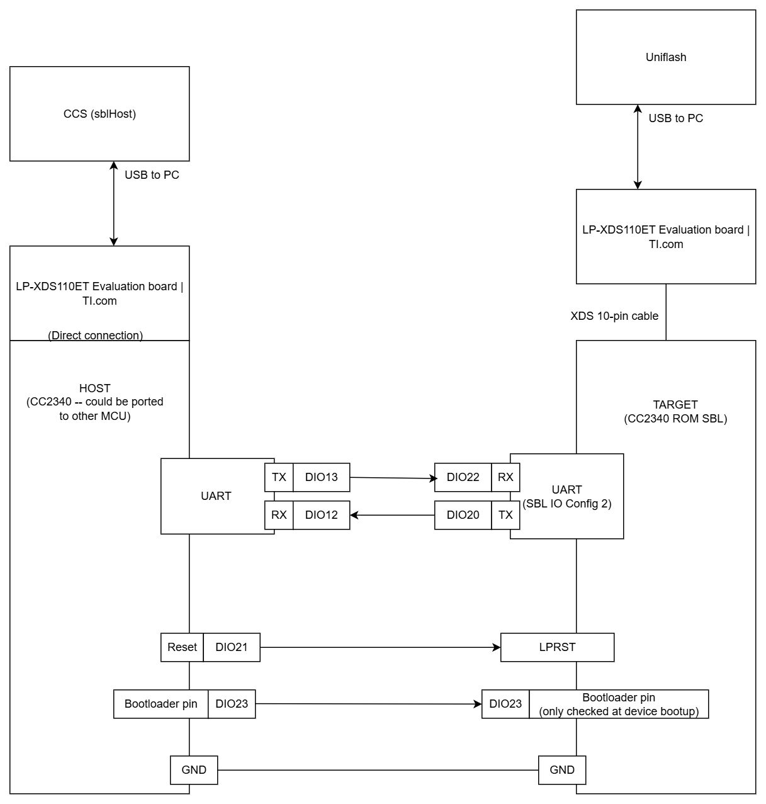

# MCU-based Embedded Bootloader Host for CC2340

## Introduction

This project implements an MCU-based host interface ("HOST") to ROM Serial Bootloader (SBL) of CC2340 ("TARGET").
It may be used as an option for updating the firmware on TARGET using readily available serial (UART) module.
Two firmware samples are provided within the HOST for updating the TARGET.

For more details regarding the CC2340 ROM SBL, please refer to the [Technical Reference Manual](https://www.ti.com/lit/pdf/swcu193) Chapter 8 "Device Boot and Bootloader".

---

## Features

- **Host-side implementation for CC2340 SBL**: Connect, Erase, Program, Reset.
- **Two sample firmware for TARGET**: The `fw_ver_1` toggles the TARGET board red LED every 500msec; the `fw_ver_2` toggles the TARGET board red LED every 250msec.
- **Abstraction layers**: Easily porting the underlying implementations for firmware storage accessor and serial communication interface.

---

## Prerequisites

### Hardware Requirements

- 2x [LP-EM-CC2340R5 Launchpad](https://www.ti.com/tool/LP-EM-CC2340R5)
- 2x [LP-XDS110 Debugger](https://www.ti.com/tool/LP-XDS110ET)
- 2x USB Type-C to USB-A cable (included with LP-XDS110ET debugger)
- Jumper wires

### Software Requirements

- **SDK**: `simplelink_lowpower_f3_sdk_9_10_00_83`
- **IDE**: Code Composer Studio (CCS) 20.1
- **TI CLang**: `v4.0.1.LTS`

---

## How to Use

1. Connect TARGET to Uniflash and perform a chip-erase.

1. Connect the HOST and TARGET according to the block diagram.

    

1. Connect HOST to CCS and enter debugger with the `sblHost` project. Let it run to the first `while (waitingForUser)`.

1. In CCS, set variable `waitingForUser` to 0.
The firmware version may also be selected by writing a 1 or 2 to the variable `gFwVerToLoad` (1 will load a FW which toggles the TARGET board red LED every 500msec, and 2 will load a FW which toggles the TARGET board red LED every 250msec).
    * Note that in practice, all of this can be done without human interaction.

1.  Resume running the program.

1. After 1-2 sec, you should see the TARGET blink its red LED (meaning firmware was loaded by SBL successfully).
If not, a good first step to diagnose the issue is to connect logic analyzer to the pins here, and re-start from step 1.

---

## Firmware Binary

The firmware images (and their C-array representations) located in folder `sample_fw/testFwBytes.c` (both `fw_ver_1*` and `fw_ver_2*`) were generated using the `script/bin_to_carray.py` (tested with Python 3.8 and likely works with newer versions).

The input of this script is a `.bin` file from a CCS project. The CCS project would need to have post-build steps, such as:
```
    ${CG_TOOL_ROOT}/bin/tiarmobjcopy ${ProjName}.out --output-target binary ${ProjName}-no-ccfg.bin --remove-section=.ccfg

    ${CG_TOOL_ROOT}/bin/tiarmobjcopy ${ProjName}.out --output-target binary ${ProjName}-ccfg.bin --only-section=.ccfg
```

This is done twice, once for the MAIN flash ( option `--remove-section=.ccfg`) and once for the CCFG flash (option `--only-section=.ccfg`)

Once that project is built in CCS, then the `.bin` files will be located in its output folder.
These locations can be passed to the `bin_to_carray.py` to generate the C-array representation of both the `.bin` files, such as:
```
python bin_to_carray.py C:\ccs_workspaces\sampleProjects\empty_LP_EM_CC2340R5_freertos_ticlang\Debug\empty_LP_EM_CC2340R5_freertos_ticlang-no-ccfg.bin

python bin_to_carray.py "C:\ccs_workspaces\sampleProjects\empty_LP_EM_CC2340R5_freertos_ticlang\Debug\empty_LP_EM_CC2340R5_freertos_ticlang-ccfg.bin"
```

After completion, this Python script will printout the output location of the `.c` files. The content of the resulting `.c` files should be copied to the sblHost project (see examples of this done for `fw_ver_1_mainFlash` and `fw_ver_2_mainFlash`).
This in turn allows evaluation of the sblHost functionality.

In actual practice, these new firmware update images would be delivered by a dynamic mechanism, such as OTA (over-the-air) updates. This is left as an exercise to the user.

---
