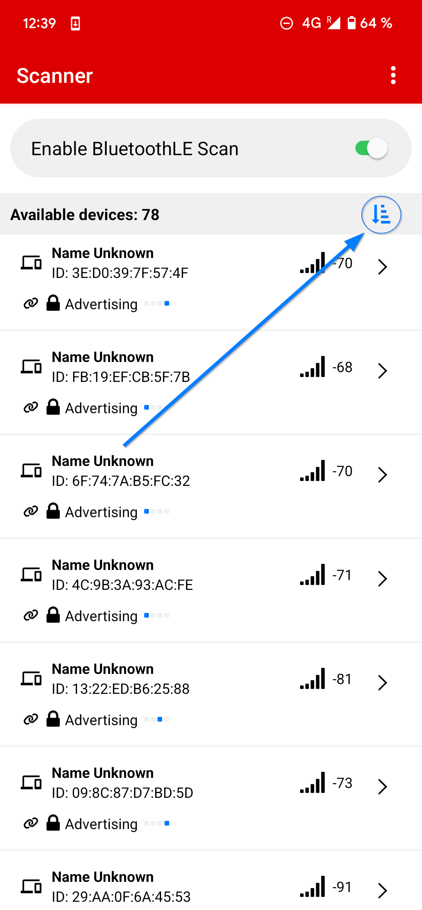
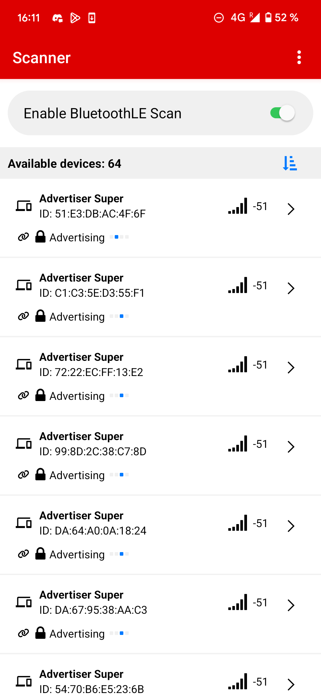
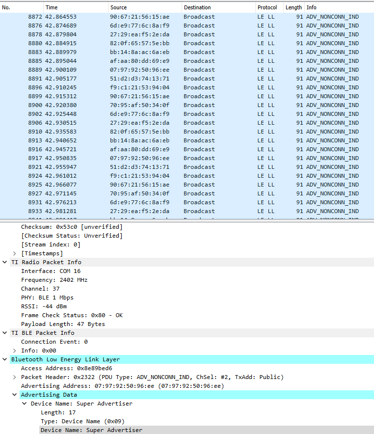

# Super Advertiser Example

## Table of Contents

<!-- @import "[TOC]" {cmd="toc" depthFrom=2 depthTo=6 orderedList=false} -->

<!-- code_chunk_output -->

- [Table of Contents](#table-of-contents)
- [Example Summary](#example-summary)
- [Required Hardware](#required-hardware)
- [Dependencies](#dependencies)
- [Setting up the project](#setting-up-the-project)
- [Verifying the advertisement](#verifying-the-advertisement)
- [Configuration of the Super Advertiser](#configuration-of-the-super-advertiser)
- [Changing the default number of emulated devices](#changing-the-default-number-of-emulated-devices)
- [Changing the adverising interval](#changing-the-adverising-interval)
- [Notes about usage with TI SimpleLink™ Connect](#notes-about-usage-with-ti-simplelinktm-connect)
- [Usage on multiple physical devices](#usage-on-multiple-physical-devices)

<!-- /code_chunk_output -->

## Example Summary

The `super_advertiser_ble_LP_EM_CC2340R5_freertos_ticlang` example project 
uses the CC2340R5 to stress test Central or Observer devices by sending 
advertisement packets from a configurable amount of emulated devices, with the 
following features:
 * Configuration menu: a menu is accessible through UART and is interactable 
 through the buttons on the device, that allows to change the settings of the 
 project.

 * Changeable number of emulated devices: the amount of devices that the 
 CC2340R5 will emulate can be increased or decreased through the menu. 
 [The default number of devices can be changed by changing the `SUPER_ADV_SETTINGS_DEFAULT_NUM_OF_ADDRESS` macro](#changing-the-default-number-of-emulated-devices)

 * Toggling on/off: the emulation of the devices can be stopped or restated 
 quickly through the menu, so that the user is not permanently flooded with 
 advertisements.

For testing purposes, a smartphone with TI SimpleLink™ Connect App installed on
it is recommended.

## Required Hardware
* Broadcaster
  * 1 x [LP-EM-CC2340R5](https://www.ti.com/tool/LP-EM-CC2340R5)
  * 1 x [LP-XDS110ET](https://www.ti.com/tool/LP-XDS110ET)
* Central
  * 1 x [Smartphone with TI SimpleLink™ Connect App](https://dev.ti.com/tirex/explore/node?node=A__Af6ue7WVKTMCYaoKZ-dN.g__SIMPLELINK-ACADEMY-CC23XX__gsUPh5j__LATEST)

## Dependencies

* `super_advertiser_ble_LP_EM_CC2340R5_freertos_ticlang`
  * Simplelink F3 SDK 8.40.02.01
  * Code Composer Studio 12.8.1 / Code Composer Studio Theia 20.1.1
  * UniFlash 9.0.0.5086

## Setting up the project

1. First, open Code Composer Studio and create a new workspace.

2. Import the project by clicking Project > Import CCS Projects ...

3. Browse to the `super_advertiser_ble_LP_EM_CC2340R5_freertos_ticlang` 
folder, and click Finish

4. In the Project Explorer tab on the left, left click the Super Advertiser 
project to select it.

5. Click the Debug (green bug) button at the top.

6. Once the project has finished building and is flashed on the board, click 
the Resume (green triangle) button.

## Verifying the advertisement

After setting up the project and having the super advertiser running on your 
board, you can open TI SimpleLink™ Connect App on your smartphone. 

Currently, you may mostly see devices that don't have a name because they are 
not scannable devices. To fix this, you can press the blue button to sort the 
result from strongest connection to weakest.

You should be presented with the amount of emulated devices that you configured 
previously for the super advertiser, similar to this image. 

When using Packet Sniffer with Wireshark (you can read how to setup Packet 
Sniffer in the [F3 SDK User Guide](https://dev.ti.com/tirex/content/simplelink_lowpower_f3_sdk_8_40_00_61/docs/ble5stack/ble_user_guide/html/ble-stack-5.x-guide/debugging-index-cc23xx.html#packet-sniffer)), the advertisement packets 
received look like this :

We can see that the interval between packets is around 50ms, and every 50ms the 
address is changed. This is due to the 20ms advertising interval, the time 
taken to disable advertising, change the emulated device, and re-enable 
advertising.

## Configuration of the Super Advertiser

The `super_advertiser_ble_LP_EM_CC2340R5_freertos_ticlang` can be configured 
using the UART menu and the buttons on the CC2340R5. The left button (BTN-1) 
moves the cursor to the next option, and the right button (BTN-2) selects the 
option that the cursor is currently facing. Here's a list of all the options : 

  |           Option         |    Location      |                Description               |
  |:------------------------:|:----------------:|:----------------------------------------:|
  | __`Increment`__          | Settings Menu    | Increment the number of emulated devices |
  | __`Decrement`__          | Settings Menu    | Decrement the number of emulated devices |
  | __`Toggle advertising`__ | Advertising Menu | Toggle the advertising on/off            |

When the number of emulated devices is changed, the pool is entirely
re-generated with the new number of emulated devices, deleting the previous
addresses used in the pool.

## Changing the default number of emulated devices

To change the default number of emulated devices, you can change the value 
of `SUPER_ADV_SETTINGS_DEFAULT_NUM_OF_ADDRESS` in 
`super_advertiser_ble_LP_EM_CC2340R5_freertos_ticlang/app/app_super_adv.h`

## Changing the adverising interval

By default, the advertising interval is at 20ms, which is the minimum value 
accepted by the bluetooth 5.2 specification. If you wish to change this 
interval for your testing needs, you need to first 
[setup the project](#setting-up-the-project).

Once your project is set up, you can open the `super_advertiser_ble.syscfg` 
file and navigate to BLE > Broadcaster configuration > Advertisement Set 1 >
Advertisement Parameters 1, and change both `Primary PHY Interval Minimum` and
`Primary PHY Interval Minimum` to your desired value. The value must be a 
multiple of 0.625.

## Notes about usage with TI SimpleLink™ Connect

The TI SimpleLink™ Connect displays emulated devices that it was able to 
see, but hides them if no advertisement from them have been received in a long 
period of time (around 5 seconds). With a very high amount of emulated devices, 
it is possible that the TI SimpleLink™ Connect App may not show all of them at 
the same time because the Super Advertiser loops linearly through all 
advertising addresses, and may take more than 5 seconds to do an entire loop. 

## Usage on multiple physical devices

If you need to have more than 100 emulated devices, we recommend flashing 
multiple CC2340R5 with this example. One way to flash multiple boards would 
be the following :

1. First, open Code Composer Studio and create a new workspace.

2. Import the project by clicking Project > Import CCS Projects ...

3. Browse to the `super_advertiser_ble_LP_EM_CC2340R5_freertos_ticlang` 
folder, and click Finish.

4. In the Project Explorer tab on the left, left click the Super Advertiser 
project to select it.

5. Click the Build (hammer) button at the top.

6. Once the project has finished building, open UniFlash and select the 
CC2340R5 board.

7. Click the green Browse button and select the 
`super_advertiser_ble_LP_EM_CC2340R5_freertos_ticlang.hex` file.

8. Click Load Image.

9. Once it's completed, power cycle the board.
