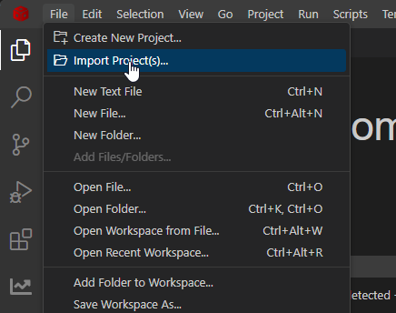
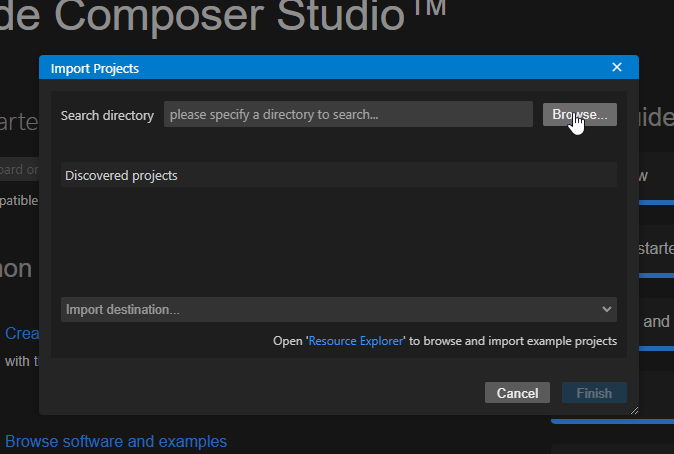
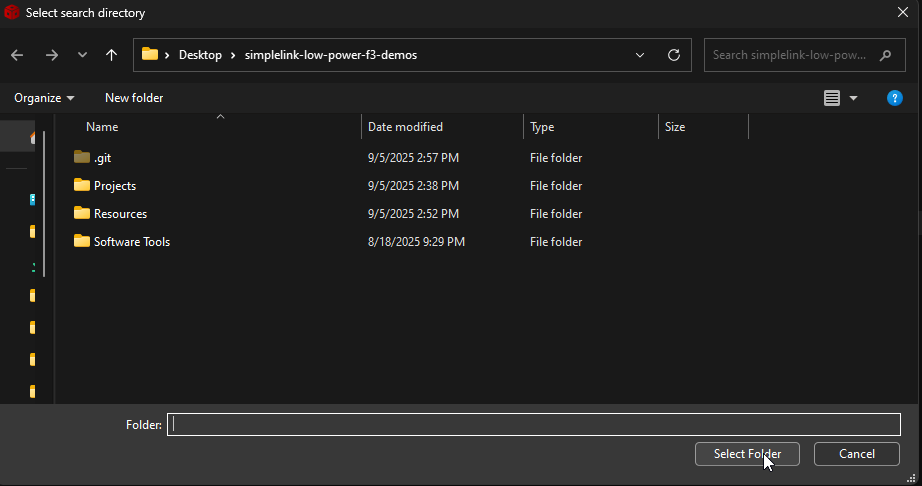
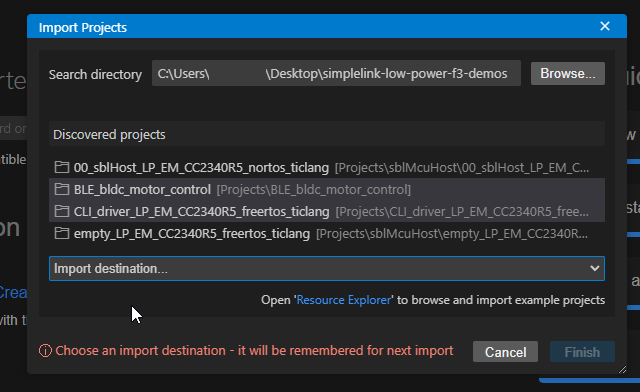
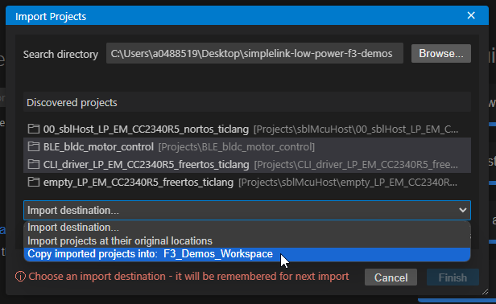
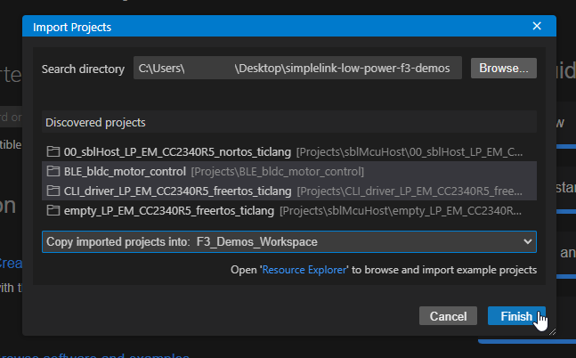
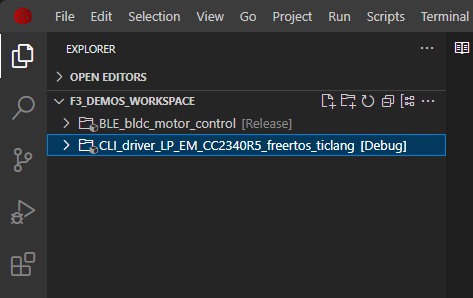

# SimpleLink Low Power F3 Demos

This repository contains demos and supporting collateral for the SimpleLink Low 
Power F3 family of devices. All material shared in this repository is provided 
as-is.

---

## Getting Started

### Required Software
To work with the examples in this repository, you will need the following 
software tools:

1. **SimpleLink Low Power F3 SDK**  
   - [Download the SDK](https://www.ti.com/tool/download/SIMPLELINK-LOWPOWER-F3-SDK)  
   - The SDK includes drivers, libraries, and examples for the F3 family of 
     devices. Reference the Examples section of this ReadMe for the exact SDK
     version required for a given example.

2. **Code Composer Studio (CCS)**  
   - [Download CCS](https://www.ti.com/tool/CCSTUDIO)  
   - CCS is the recommended IDE for developing and debugging applications for 
     the F3 family.

3. **Uniflash**  
   - [Download Uniflash](https://www.ti.com/tool/UNIFLASH)  
   - Uniflash is used for programming and debugging the F3 devices.

---

## How to Import an Example

Follow the steps below to import an example project into Code Composer Studio 
(CCS). Images are provided for reference to guide you through the process.

1. **Open CCS Workspace**  
   Launch Code Composer Studio and select a workspace directory where your 
   projects will be stored.  

2. **Navigate to Import Projects**  
   In the top menu, click on `File` -> `Import`. This will open the Import 
   Wizard.  

   

3. **Browse to the Repository Location**  
   In the Import Wizard, select `Code Composer Studio` -> `Projects`. Then, 
   click `Browse` and navigate to the top-level folder of the repository or 
   the specific project folder you want to import.  

   

4. **Select the Project Folder**  
   Once you locate the desired folder, click `Select Folder`. The Import Wizard 
   will display all the projects available in the selected folder.  

   

5. **Select Projects to Import**  
   Check the boxes next to the projects you want to import. You can use 
   `Shift + Click` to select multiple projects at once.  

   

6. **Copy Projects into Workspace**  
   Expand the `Import Location` section and check the option to copy the 
   projects into your workspace. This ensures a local copy of the project is 
   created in your workspace.  

   

7. **Finish the Import Process**  
   Click `Finish` to complete the import process. The selected projects will 
   now appear in your CCS workspace.  

   

8. **Build and Run the Projects**  
   The imported projects are now ready to build and run. Select a project, 
   click the `Build` button, and follow the instructions in the example's 
   README file to execute it.  

   

---

### Notes:
- Ensure you have the correct SDK version installed for the project you are 
  importing.
- Refer to the [**Examples**](#examples) section in this README for details on the required 
  SDK version, board, and CCS version for each project.

## Software Tools

The following table lists the software tool included in this repository:

| **Tool Name**              | **OS**          | **Version**         | **Prerequisites**            | **Description**                                                                 |
|----------------------------|-----------------|---------------------|------------------------------|---------------------------------------------------------------------------------|
| UniScript CLI HSM Flasher  | OS Agnostic     | SDK Version Agnostic| Python 3.9+ and Uniflash 9.2 | A Python-based Command-Line Interface (CLI) flasher that supports HSM flashing for the CC27XX family of devices. |

---

## Examples

The following table lists the examples included in this repository:

| **Example Name**          | **SDK Version**  | **Board**          | **CCS Version** | **Description**                                                                 |
|---------------------------|------------------|--------------------|-----------------|---------------------------------------------------------------------------------|
| BLE BLDC motor control    | 8.40.0.61       | LP-EM-CC2340R5     | 20.2.0          | Brushless DC (BLDC) motor control using a BLE radio interface.                 |
| BLE Sensor Suite          | 9.12.00.19      | LP-EM-CC2340R5     | 20.3.0          | Uses the BP-BASSENSORSMKII to transmit data to the SimpleLink Connect App      |
| CLI Driver Example        | 8.40.2.01       | LP-EM-CC2340R5     | 20.1.1          | Demonstrates a UART-based Command Line Interface (CLI) driver.                 |
| Sharp128 TFT LCD          | 9.12.00.19      | LP-EM-CC2340R5     | 20.3.0          | Uses the Display driver to write output to the BOOSTXL-SHARP128 LCD display    |
| Full GATT Client          | 9.10.0.83       | LP-EM-CC2340R5     | 20.3.0          | GATT Client that uses the GATT API functions to query the GATT table of any central. |
| LCD                       | 9.11.0.18       | LP-EM-CC2340R5     | 20.2.0          | Driving a 1/3 bias, 3-COM, 7-segment LCD with backlight and contrast control   |
| MCUboot XIP                       | 9.14.0.41       | LP-EM-CC2340R5     | 20.3.1  | Creating customized bootloader that can deterministically switch between images |
| PropRF Echo RX            | 9.11.0.18       | LP-EM-CC2340R5     | 20.2.0          | Proprietary Echo RX example modified for stepper motor commands.               |
| PropRF Echo TX with stepper motor  | 9.11.0.18 | LP-EM-CC2340R5  | 20.2.0          | Proprietary Echo TX example with added stepper motor functionality.            |
| rfPacket IEEE test        | 9.12.0.19       | LP-EM-CC2340R5     | 20.2.0          | Proprietary RF RX/TX example using the IEEE 802.15.4 PHY. |
| mcuSblHost                | 9.10.0.83       | LP-EM-CC2340R5     | 12.8.1          | Reference example to interface with a CC2340R5 ROM Serial Bootloader (SBL).     |
| PWM output with DMA       | 9.11.0.18       | LP-EM-CC2340R5     | 20.2.0          | Demonstrates PWM output control using a DMA lookup table.                      |
| Zigbee Simple Combo       | 9.14.0.35       | LP-EM-CC2340R5     | 20.2.0          | Zigbee Coordinator with combined OnOff Light and Green Power Sink applications.  |
| Super Advertiser          | 9.10.0.83       | LP-EM-CC2340R5     | 20.3.0          | Broadcaster that sends as much advertisements as possible to stress test centrals. |
| UART Commandline Example  | 8.40.2.01       | LP-EM-CC2340R5     | 20.1.1          | Provides a simple UART-based command-line interface for user interaction.      |
| Zigbee Window Controller  | 9.11.0.18       | LP-EM-CC2340R5     | 20.2.0          | Zigbee Coordinator with Window Controller ZCL.                                 |
| Zigbee Window Covering    | 9.11.0.18       | LP-EM-CC2340R5     | 20.2.0          | Window Covering sleepy ZED node with Brushed DC (BDC) and hall effect sensor.  |
| ANCS & AMS          | 9.14.0.35       | LP-EM-CC2745R10-Q1     | 20.4.0          | Peripheral that will connect to iOS device and subscribe to ANCS and AMS services |
| Second UART          | 8.40.2.01       | LP-EM-CC2340R5     | 20.1.1          | Demonstrates a second (Software-based) uart in a BLE example on the CC2340R device.  |
---

## Additional Resources

- [SimpleLink Academy](https://dev.ti.com/tirex/explore/node?node=A__AEIJm0rwIeU.2P1OBWwlaA__SIMPLELINK-ACADEMY-CC23XX__gsUPh5j__LATEST)  
  Learn how to use the SimpleLink SDKs with step-by-step tutorials.
  
- [SimpleLink Low Power F3 SDK Documentation Overview](https://dev.ti.com/tirex/explore/node?node=A__AHaph7YfvcrVy2cDlmb4sQ__com.ti.SIMPLELINK_LOWPOWER_F3_SDK__58mgN04__LATEST)  
  Access the full documentation for the SDK.

- [TI E2E Community](https://e2e.ti.com/)  
  Get support and interact with the TI developer community.

---

## Disclaimer

All material in this repository is provided as-is without any guarantees or 
warranties.
